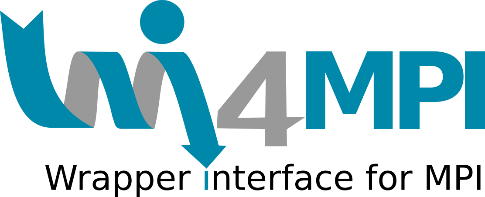

# WI4MPI



This is **WI4MPI**, Wrapper Interface For MPI performing a light translation between MPI constants and MPI objects from an MPI implementation to another one.

WI4MPI provides two different mode:

Preload :


Interface :


## Installation

### Prerequisites

* C and Fortran compiler

WI4MPI has been tested on GNU/Linux only

### Compilation

```
$ mkdir BUILD ; cd BUILD
$ cmake -DCMAKE_INSTALL_PREFIX=/path-install/wi4mpi-%version /path/to/wi4mpi/source/root
$ make -j 4 && make install
```

You may use the following environment variables to customize the configure and build steps :
WI4MPI_COMPILER=<INTEL, GNU, PGI, LLVM, ARMCLANG, FUJITSU>

WI4MPI_RELEASE=<DEBUG, RELEASE, GCC_JITI>

### Documentation

Wi4MPI documentation is built with `Sphinx`, choose your prefered format.
Example with `html`:

```
$ cd doc/
$ make html
$ firefox build/html/index.html
```

## Quick start

WI4MPI dedicated launcher available in /path-install/wi4mpi-%version/bin/mpirun allow an easy use of the
 library. To work, users only have to set the path to the different MPI implementation installation in /
path-install/wi4mpi-%version/etc/wi4mpi.cfg configuration file.

```
Usage: mpirun [MPIRUN_TARGET_OPTIONS] -- [PROGRAM] [PROGRAM_OPTIONS]
Advanced options:
    -F | -from | --from {FROM}      The MPI implentation from which PROGRAM was compiled with
    -T | -to | --to {TARGET}        The MPI implentation to which PROGRAM will be run

The -F FROM option is optionnal. If not provided, the interface mode is choosen.
```

```
$ source share/wi4mpi/setup-env.sh
```

```
$ mpirun -np 4 -F openmpi -T intelmpi ./mpi_hello.exe
You are using Wi4MPI-%version with the mode preload From OMPI To INTEL
Hello_world 0
Hello_world 2
Hello_world 3
Hello_world 1

$ mpirun -np 4 -T intelmpi ./mpi_hello.exe
You are using Wi4MPI-%version with the mode interface From Interface To INTEL
Hello_world 0
Hello_world 1
Hello_world 2
Hello_world 3
```

## Features

With the Interface mode a default conversion can be set during the compilation of the user application:

```
-wi4mpi_default_run_path    set a default MPI conversion
                            for the user application.
                            accepted values :
                              - OMPI
                              - INTEL
                              - MPC
                              - MPICH
```
To set the conversion Interface to OpenMPI please preceed as follow:

```
$ WI4MPI_CC=icc/gcc WI4MPI_ROOT=/path/to/wi4mpi/root mpicc -wi4mpi_default_run_path OMPI test.c -o init

mpirun -np 4 ./init
```

With the interface mode, wi4mpi provide an embedded mode where the binary file can be moved from a cluster to another one without compilation process. The only rule is to have IntelMPI, MPICH/MVAPICH or OpenMPI available the system

## Configuration

All variable used by WI4MPI to configure the library according to the different modes and conversions:

WI4MPI environment variables:

* **WI4MPI_ROOT**             : reference to root wi4mpi installation
* **WI4MPI_CC**               : reference C compiler used by wi4mpi
* **WI4MPI_FC**               : reference Fortran compiler used by wi4mpi
* **WI4MPI_CXX**              : reference C++ compiler used by wi4mpi
* **WI4MPI_RUN_MPI_C_LIB**    : reference the path to the underlying run MPI implementation path C library
* **WI4MPI_RUN_MPI_F_LIB**    : reference the path to the underlying run MPI implementation path Fortran library
* **WI4MPI_RUN_MPIIO_C_LIB**  : reference the path to the underlying run MPI-IO implementation path C library
* **WI4MPI_RUN_MPIIO_F_LIB**  : reference the path to the underlying run MPI-IO implementation path Fortran library
* **WI4MPI_WRAPPER_LIB**      : reference the path to the wrapper library call by the interface
* **WI4MPI_APP_INCLUDES**     : reference the path to the internal include used by the jit trick to handle user function
* **WI4MPI_COMPILE_OPT**      : reference the option passed during jit compilation
* **WI4MPI_INTERNAL_INCLUDE** : reference the path to the internal include necessary to jit
* **WI4MPI_FROM**             : reference FROM which MPI implementation the application has been compiled
* **WI4MPI_TO**               : reference the desired Runtime MPI implementation
* **LD_PRELOAD**              : see [`man 8 ld.so`][MANLDSO]
* **LD_LIBRARY_PATH**         : see [`man 8 ld.so`][MANLDSO]

  [MANLDSO]: https://man7.org/linux/man-pages/man8/ld.so.8.html

Preload settings:

{FROM} and {TO} can take as value OMPI or INTEL depending on the choosen conversion.

```
export WI4MPI_RUN_MPI_C_LIB="/path/to/MPI-runtime-implementation/libmpi.so"
export WI4MPI_RUN_MPI_F_LIB="/path/to/MPI-runtime-implementation/libmpi_mpifh.so"
export WI4MPI_RUN_MPIIO_C_LIB="/path/to/MPI-runtime-implementation/libmpi.so"
export WI4MPI_RUN_MPIIO_F_LIB="/path/to/MPI-runtime-implementation/libmpi_mpifh.so"
export LD_PRELOAD="path_to_wi4mpi_install/libexec/libwi4mpi_{FROM}_{TO}.so $WI4MPI_RUN_MPI_F_LIB $WI4MPI
_RUN_MPI_C_LIB"
export WI4MPI_APP_INCLUDES="/path/to/wi4mpi/INTERNAL/preload/include/{FROM}_{TO}"
if OpenMPI --> OpenMPI
  export LD_LIBRARY_PATH="path_to_wi4mpi_install/libexec/fakelibCXX:$LD_LIBRARY_PATH"
  WI4MPI_COMPILE_OPT "-DOMPI_OMPI"
else if OpenMPI --> IntelMPI
  export LD_LIBRARY_PATH="path_to_wi4mpi_install/libexec/fakelibCXX:path_to_wi4mpi_install/libexec/fakel
ibOMPI:$LD_LIBRARY_PATH"
  WI4MPI_COMPILE_OPT "-DOMPI_INTEL"
else if IntelMPI --> IntelMPI
  export LD_LIBRARY_PATH="path_to_wi4mpi_install/libexec/fakelibCXX:$LD_LIBRARY_PATH"
  WI4MPI_COMPILE_OPT "-DINTEL_INTEL"
else if IntelMPI --> OpenMPI
  export LD_LIBRARY_PATH="path_to_wi4mpi_install/libexec/fakelibCXX:path_to_wi4mpi_install/libexec/fakel
ibINTEL:$LD_LIBRARY_PATH"
  WI4MPI_COMPILE_OPT "-DINTEL_OMPI"
```

Interface settings:

{FROM} and {TO} can take as value OMPI, INTEL or MPC depending on the choosen conversion.

```
export WI4MPI_INTERNAL_INCLUDES="path_to_install/INTERNAL/include"
export WI4MPI_ROOT="/path_to_wi4mpi_install_root"
export WI4MPI_CC=icc
export WI4MPI_FC=ifort
export WI4MPI_CXX=icpc
export WI4MPI_RUN_MPI_C_LIB="/path/to/MPI-runtime-implementation/libmpi.so"
export WI4MPI_RUN_MPI_F_LIB="/path/to/MPI-runtime-implementation/libmpi_mpifh.so"
export WI4MPI_RUN_MPIIO_C_LIB="/path/to/MPI-runtime-implementation/libmpi.so"
export WI4MPI_RUN_MPIIO_F_LIB="/path/to/MPI-runtime-implementation/libmpi_mpifh.so"
export WI4MPI_WRAPPER_LIB="path_to_wi4mpi_install/lib_INTEL/libwi4mpi_{TO}.so"
export WI4MPI_APP_INCLUDES="path_to_install/INTERNAL/interface/include/{FROM}_{TO}"
export LD_LIBRARY_PATH="path_to_install/lib:$LD_LIBRARY_PATH"
if Interface --> IntelMPI
  export WI4MPI_COMPILE_OPT="-D_OMPI"
else if Interface --> OpenMPI
  export WI4MPI_COMPILE_OPT="-D_INTEL"
else if Interface --> MPC
  export WI4MPI_COMPILE_OPT="-D_MPC"
```


## Contributing
## Authors/contributors

* vincent.ducrot.tgcc@cea.fr
* tony.delforge.tgcc@cea.fr
* adrien.cotte.tgcc@cea.fr
* clement.fontenaille.tgcc@cea.fr
* kevin.juilly.tgcc@cea.fr
* marc.joos@cea.fr

## Contact

* bruno.froge@cea.fr
* marc.perache@cea.fr
* marc.joos@cea.fr

## Website

[CEA-HPC](http://www-hpc.cea.fr/)


## License

Copyright 2015-2017 CEA/DAM/DIF<br />
<br />
WI4MPI is distributed under the BSD-3-Clause OR CeCILL-B.
